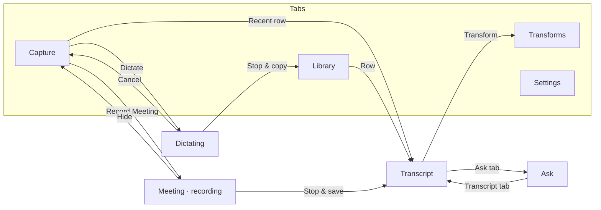

# Parakeet for iPhone — Design Handoff

> **Status: PROPOSED — design exploration, not an accepted decision.** No iOS
> target, iOS code, or ADR exists. Repo facts below were checked against `main`
> at `bbae9e0` on 2026-09-22. The claims under
> [Platform feasibility](#platform-feasibility--verify-before-building) come
> from model knowledge and are **unverified**; check them against current Apple
> documentation before relying on them.

## Start here

An 8-screen iPhone design exists that carries MacParakeet's functionality and
"Warm Magical" visual language to iOS. There is no code.

1. Read this file, then [`AGENTS.md`](../../AGENTS.md), then
   [`spec/02-features.md` §F30](../../spec/02-features.md) (the only existing
   iOS roadmap entry).
2. Look at the design canvas (below).
3. Do not start with UI. Follow [Recommended sequence](#recommended-sequence):
   ADR → feasibility spike → Core portability → app shell.
4. Where this document and the canvas disagree, this document wins — see
   [Corrections](#corrections-the-implementation-must-apply).

Kickoff prompt for a fresh Claude Code session (paste as-is):

```text
Read docs/plans/2026-09-22-001-feat-iphone-app-design-handoff.md in full,
then AGENTS.md. We are starting the "Parakeet for iPhone" work it describes.
Do not write UI code yet. First: (1) check every item under "Platform
feasibility" against current Apple documentation and report which claims
hold, (2) walk me through "Open questions for the owner" and draft the ADR
the doc calls for, (3) scope the Phase 1 feasibility spike. The design canvas
is https://claude.ai/artifact/3KyBVG6YkYwGA97kW1nmiZ — read its files with
the Artifact tool when you need exact values.
```

## Where the design lives

- **Canvas:** <https://claude.ai/artifact/3KyBVG6YkYwGA97kW1nmiZ> ("MacParakeet
  for iPhone"). Private to the repo owner's claude.ai account; nobody else can
  open it unless the owner shares it.
- **Reading it from a session:** Artifact tool, `action: "read"`, that `url`,
  and `paths` such as `["project/canvas.json", "project/Home.dc.html"]`. Boards:
  `Home`, `Dictating`, `Meeting`, `Library`, `Transcript`, `Ask`, `Transform`,
  `Settings` — each at `project/<Name>.dc.html`.
- **Format:** each `.dc.html` is one self-contained HTML page with inline
  styles. Boards are 390×844, so **1 CSS px = 1 iOS pt**. The files render only
  inside the canvas runtime (`./support.js` is not in this repo); read them as
  source for exact values, not as pages to open.
- **Deliberately not committed:** the canvas's sample content (meeting titles,
  transcripts, dictations) is fictional but drawn from a military-unit setting.
  This fork is public, so that content stays out of the repo. Use neutral
  fixtures in code, SwiftUI previews, screenshots, and tests.
- **Removed board:** a ninth board, *Live Activity / Dynamic Island*, was
  deleted from the canvas after first publish. Its spec is preserved
  [below](#removed-board-live-activity--dynamic-island) because the platform may
  require it (feasibility item 3).

## Product intent

The iPhone app — working wordmark **Parakeet** (provisional, not a naming
decision) — is a local-first sibling of MacParakeet: the same capture modes
(dictation, file/link import, meeting recording), Library, Ask, and Transforms,
in the same design system, adapted to iOS idioms. These invariants carry over
unchanged from `spec/02-features.md` (Privacy Requirements), ADR-002, and
ADR-027:

- Speech recognition runs on device. No cloud STT.
- No accounts, no login.
- Audio never goes to an LLM; text reaches an LLM only through explicitly
  configured AI features.
- Core capture and transcription work offline after model setup.

### Scope versus F30

F30 reads: *"Share transcripts between Mac and iPhone. Capture in-person
conversations on iPhone."* The canvas both exceeds and omits it:

| Capability | F30 | Canvas |
|---|---|---|
| In-person capture on iPhone | yes | yes (Meeting) |
| Mac ↔ iPhone transcript sharing | yes | **not designed** |
| Dictation, file/link import, Library, Ask, Transforms, Settings | — | yes |

Reconciling these is Open question 1.

## Navigation map



The canvas prototype follows this map. The **Transforms** tab points at the
Share Sheet board as a stand-in; a Transforms management screen (list, edit,
custom Transforms) is not designed.

## Screen specs

All screens: 390×844 pt, content starts 56 pt from the top (the canvas omits the
status bar on purpose), 24 pt side gutter. Build tab bars, navigation bars,
segmented controls, toggles, and sheets from **native SwiftUI**
(`TabView`, `NavigationStack`, `Picker(.segmented)`, `Toggle`, sheet detents)
tinted with the tokens — do not pixel-copy the canvas's hand-drawn chrome. The
metrics below matter for the custom surfaces. Token names refer to
[Design tokens](#design-tokens).

### 1. Capture — `Home.dc.html`

Mac counterparts: `Sources/MacParakeet/Views/Transcription/TranscribeView.swift`,
`Views/Transcription/MeetingRecordingTile.swift`; `MeetingRecordingPillViewModel`
(shared tile/pill state). Top to bottom, 14 pt gaps:

- **Header** (40 h): 27 pt parakeet mark in `accent`; "Parakeet" (rounded 22
  bold); trailing "On device" chip (26 h capsule, lock glyph, 11.5 semibold,
  white, 1 pt `border`).
- **Dictate hero** (→ Dictating): 140 h, radius 24, `accentLight` fill,
  `#F6D3C3` stroke. 76 pt `accent` circle with white waveform glyph, shadow
  `0 6 16` accent @ 32 %. "Dictate" (rounded 23 bold), one-line subtitle (13.5,
  `textSecondary` — copy is wrong, see Corrections 2), status chip "Clean text
  on copy" (22 h, green dot).
- **Two capture cards** (gap 14): 108 h, radius 18, white, `border`. 34 pt icon
  tile (radius 10, `accentLight`, `accentText` glyph). "Paste a link" /
  "Import audio" (15 semibold) with caption (12).
- **Record Meeting strip** (→ Meeting): 84 h, radius 18. Green rosette 40×47,
  title 16 semibold, subtitle 12.5, "Start" capsule (34 h, `accentText` fill,
  white 14 bold). The whole strip is the target in the canvas — see
  Corrections 8.
- **Recent**: header (12.5 bold uppercase, 0.07 em tracking) + "See all"
  (→ Library). Rows 62 h, radius 14; 40 pt leading tile (Seed-of-Life cover for
  meetings, `accentLight` waveform tile for dictations, neutral clock tile for
  queued work); title 14.5 semibold one line; meta 12. In-progress row shows
  "Transcribing · 62%" in `accentText` semibold.

### 2. Dictating — `Dictating.dc.html`

Mac counterparts: `Views/Dictation/DictationOverlayView.swift`,
`Views/Dictation/WaveformView.swift`; spec/04-ui-patterns.md "Dictation
Overlay / Pill".

- Full-screen dark ground `#141417` (the Mac pill uses `#1C1C1E`).
- **Status row** (30 h): 9 pt `errorRed` dot, "DICTATING" (12.5 bold, 0.1 em
  tracking, white @ 72 %), engine chip "Parakeet v3 · on device" (white @ 10 %).
- **Center stack** (gap 30, vertically centered):
  - Streaming partial transcript, 19 pt / 1.58: confirmed text white @ 94 %,
    unconfirmed tail white @ 42 %, 2×19 caret in dark-mode accent `#FF8A5C`.
    Mac precedent: the live preview is display-only; what gets copied is the
    final transcript, never the preview (plans/README.md, live-dictation row).
  - Waveform: 27 bars, 4 wide, 5 gap, radius 2, heights 8–58; the six center
    bars `#FF8A5C`, the rest white @ 92 %.
  - Timer 44 bold, tabular digits.
- **Controls** (bottom-aligned, gap 34; labels 11.5): Cancel (62 circle, white
  @ 10 %, ✕ in `#FF8A8A`) · **Stop & copy** (88 circle, `accent`, 30 pt white
  rounded square, soft coral shadow) · **Polish after** toggle (62 circle; on =
  accent @ 22 % fill with `#FF8A5C` stroke, glyph, and label).
- Footer (12.5, white @ 72 %): "Clean text lands on your clipboard. / Audio and
  transcript never leave this iPhone."
- Prototype links: Cancel → Capture, Stop → Library.

### 3. Meeting · recording — `Meeting.dc.html`

Mac counterparts: `Views/MeetingRecording/MeetingRecordingPanelView.swift`
(+ `LiveNotesPaneView.swift`, `LiveAskPaneView.swift`),
`Views/Transcription/MeetingRecordingTile.swift`;
`MeetingRecordingPanelViewModel`, `MeetingRecordingPillViewModel`.

- **Nav** (44 h): hide (chevron-down → Capture), centered title + 11.5 subtitle,
  ellipsis menu.
- **Recording card**: radius 20, white, `border`, shadow `0 4 14` black @ 5 %,
  padding 15/16. Rosette 42×49 with faint halo ring (`#66D966` @ 45 %); 8 pt red
  dot + "Recording" (15.5 bold); subtitle 12.5; timer 23 bold tabular. Level
  meters: 6 h `divider` track, `successGreen` fill, 11 pt labels — two meters
  in the canvas, **one in the build** (Corrections 3).
- **Segmented control** (40 h): Notes | Transcript | Ask, Transcript selected.
- **Live transcript** (gap 18): 7 pt speaker dot (palette), name 12.5 bold in
  the deep speaker tone, time 11 tabular; body 15.5 / 1.52; unconfirmed tail in
  `textTertiary`.
- **Bottom bar**: Mute (116×48 capsule, white, `border`, mic glyph) + **Stop &
  save** (fills remaining width, 48 h, `recordingStop`, white 15.5 bold, 14 pt
  white square).
- Only the *recording* state is drawn. Carry starting / completing /
  transcribing / completed / error over from the Mac tile spec in
  spec/04-ui-patterns.md ("Meeting Recording Tile").

### 4. Library — `Library.dc.html`

Mac counterparts: `Views/Transcription/TranscriptionLibraryView.swift`,
`Views/History/DictationHistoryView.swift`; `TranscriptionLibraryViewModel`,
`DictationHistoryViewModel`. Rules: spec/04-ui-patterns.md "Library Layouts and
Meeting States".

- Large title "Library" (rounded 28 heavy) + Grid/List segmented control (List
  selected; grid layout not designed).
- Search field (44 h, radius 12, white, `border`): "Search transcripts,
  speakers, labels".
- **Filter chips** (34 h capsules, interactive in the canvas): All | Meetings |
  Dictations | Video | Local. Selected: `accentLight` fill, `#F1C9B6` stroke,
  `accentText` label. Unselected: white, `border`, `textSecondary`. *Differs
  from Mac:* Mac filters are All / Favorites / Podcasts / Video / Local /
  Meetings, with Dictations as its own sidebar tab. iPhone folds dictations into
  Library; Favorites, Podcasts, and the Labels filter are not designed.
- Date groups "TODAY" / "YESTERDAY" (11.5 bold uppercase, 0.09 em tracking),
  matching the Mac grouping.
- **Row card**: padding 12, radius 14, white, `border`, gap 12. 52 pt leading
  tile (radius 12): Seed-of-Life cover when there is no artwork, `accentLight`
  waveform tile for dictations, black play tile for video. Title 15 semibold one
  line; snippet 12.8 / 1.35, max two lines; meta 11.5 tabular. Favorite = 15 pt
  filled `warningAmber` star with accessibility label "Favorite", nothing when
  unfavorited (Mac rule). "Partial audio" badge: 18 h, `warningFill` with
  `warningText` 10.5 bold.
- Not drawn: failed rows, multi-select mode, empty state.

### 5. Transcript — `Transcript.dc.html`

Mac counterparts: `Views/Transcription/TranscriptResultView.swift`;
`TranscriptionViewModel`, `MediaPlayerViewModel`, `SavedMeetingNotesViewModel`.

- **Nav**: back chevron in `accentText` (→ Library); centered 13 pt amber star +
  title (16 semibold) over a date · duration · speakers subtitle; ellipsis.
- **Tabs** (44 h, underline style, gap 24): Transcript | Notes | Ask. Active =
  14.5 bold with 2.5 pt `accent` underline. The Notes screen is not designed
  (its tab links back to Transcript in the canvas).
- **Player card** (64 h, radius 16): 44 pt `accent` play button; 6 h scrubber
  (`divider` track, `accent` fill, 14 pt white knob with 1.5 pt accent ring);
  elapsed / total 11.5 tabular; "1×" speed chip (28 h, `divider` fill).
- **Transcript blocks** (gap 20): 8 pt dot, name 13 bold in the deep speaker
  tone, time 11.5 tabular; body 16 / 1.62. The now-playing block gets an
  `accentLight` fill, radius 12, bleeding 10 pt past the gutter.
- **Action bar** (58 h): Copy | Share | **Transform** (`accentText`,
  → Transform).

### 6. Ask — `Ask.dc.html`

Mac counterparts: `TranscriptChatViewModel`,
`Views/MeetingRecording/LiveAskPaneView.swift`, the Ask tab in
`TranscriptResultView.swift`. Providers: spec/11-llm-integration.md.

- Same nav and tabs as Transcript, Ask active.
- **Provider chip** (28 h, centered): green lock + "Answering on device" +
  chevron; tapping changes provider. See feasibility item 9.
- **Assistant turn**: 30 pt avatar (`accentLight` circle holding a 22 pt
  `accent` parakeet mark) + bubble (max 262 w, radius 16, white, `border`,
  15 / 1.5). **User turn**: right-aligned, `divider` fill, radius 16.
- **Citation chips** inside answers: 24 h, radius 7, `divider` fill, 11.5 bold
  tabular timestamps; tap seeks transcript and player.
- Suggestion chips (32 h): "Action items", "Decisions", "Draft a summary".
- **Composer**: 46 h capsule field (white, `border`, trailing mic glyph) +
  46 pt `accent` send button with up-arrow.

### 7. Transform · Share Sheet — `Transform.dc.html`

Mac counterparts: `Views/Transforms/TransformsView.swift`;
`TransformsViewModel`, `TransformEditorViewModel`. Built-ins Polish / Distill /
Decide (ADR-022, `Prompt.Category.transform`).

- Context: a host app's text selection (a Mail draft) behind a black @ 42 %
  scrim.
- **Sheet**: top radius 28, `background` fill, upward shadow; grabber 38×5
  (`#D7D7CE`); header = 24 pt `accent` mark, "Transform" (rounded 20 heavy),
  "Done".
- **Selection preview**: `divider` box, radius 14, quote glyph, 13 / 1.45
  `textSecondary`, two lines.
- **Transform rows** (68 h, radius 16, gap 8): 38 pt icon circle, title 15.5,
  description 12.5, trailing chevron.
  - *Running* (drawn on Polish): `accentLight` fill, `#F1C9B6` stroke, merkaba
    glyph (two counter-facing triangles + center dot) in `accent`, status
    "Rewriting… keeps your voice" in `accentText`, "Cancel" capsule (34 h). The
    running row is a status surface, not a button — same rule as the Mac's
    inert status surfaces.
  - Distill "Cut to the essential points" · Decide "Turn this into a
    recommendation" · custom example "Brief" ("BLUF, then three bullets").
- Footer: lock + "Replaces your selection · runs on device" — wrong, see
  Corrections 4.

### 8. Settings — `Settings.dc.html`

Mac counterparts: `Views/Settings/SettingsView.swift`; `SettingsViewModel`,
`EngineSettingsViewModel`, `LLMSettingsViewModel`, `CustomWordsViewModel`,
`TextSnippetsViewModel`.

- Large title "Settings" (rounded 28 heavy). Grouped sections: 11.5 bold
  uppercase headers; cards radius 14, white, `border`; rows 52 h (62 with
  subtitle); `divider` hairlines inset 14. Native `Toggle` tinted
  `successGreen`.
  - **Capture**: Dictation trigger → Action Button · Back Tap → Double tap ·
    Stop mode → Tap to stop (Corrections 5).
  - **Speech**: Speech model → Parakeet v3, subtitle "On device · 620 MB ·
    Neural Engine" (Corrections 1) · Language → English (US) · Speaker labels
    (on).
  - **Privacy**: info row with green lock tile (`#E8F5EC` / `#1E7B4A`),
    "Everything stays on this iPhone" / "Audio, transcripts, notes — no account,
    no upload" (Corrections 9) · "Cloud models for Ask" (off), "Off — Ask and
    Transforms run locally".
  - **Text**: Clean-up pipeline → Balanced (Corrections 6) · Custom words &
    snippets → 24.

### Removed board: Live Activity / Dynamic Island

The iPhone counterpart of the Mac's always-visible idle and meeting pills
(spec/04-ui-patterns.md): an OS-owned control that is always within reach while
recording. The board may still be recoverable from the canvas's version
history.

- **Compact island**: leading green Seed-of-Life glyph (`#66D966`); trailing
  7 pt red dot + timer (14 bold tabular).
- **Expanded island**: black, radius 38, padding 18. Rosette with stem (32×37),
  "Recording meeting" (15 bold) over a title line (12, white @ 72 %), timer 22
  bold; level bar; two 44 h buttons — "Mute mic" (white @ 14 %) and "Stop"
  (`recordingStop`).
- **Lock Screen card**: radius 20, white @ 11 % on dark; glyph, "Parakeet ·
  Recording" + title, timer 18, level bar, "Stop" capsule. The canvas drew Stop
  at 30 h, under the 44 pt target — use system Live Activity button sizing.

## Design tokens

Source of truth: `Sources/MacParakeet/Views/Components/DesignSystem.swift`.
**Port the tokens, not the canvas hex** — the canvas used literals only because
it cannot reference code.

### Colors carried over

| Token | Light | Dark (code) | iPhone use |
|---|---|---|---|
| `accent` | `#E86B3B` | `#FF8A5C` | brand glyphs, hero circle, play/send, active underline, large fills |
| `accentLight` | `#FFF0EB` | accent @ 12 % | hero card, icon tiles, selected chips, now-playing block |
| `accentDark` | `#C45429` | `#E86B3B` | unused — see `accentText` |
| `background` | `#FAFAF7` | `#1C1C1F` | screen ground |
| `surface` / `cardBackground` | `#FFFFFF` | `#2B2B2E` | cards, rows, bubbles |
| `surfaceElevated` | `#F5F5F0` | `#3B3B3D` | neutral tiles |
| `textPrimary` | `#1A1A1A` | `#FFFFFF` | body |
| `textSecondary` | `#6B6B6B` | `#A1A1A6` | captions, meta (5.3:1 on white) |
| `textTertiary` | `#9C9C9C` | `#636366` | chevrons and unconfirmed text only (2.8:1 — never readable copy) |
| `border` | `#E8E8E0` | `#4D4D52` | card strokes |
| `divider` | `#F0F0E8` | `#404045` | hairlines, tracks, segmented and chip fills |
| `successGreen` | `#33A854` | `#4ADE80` | meters, toggles, status dots |
| `warningAmber` | `#F5A624` | `#FABF24` | favorite star |
| `errorRed` | `#E64D42` | `#F77070` | recording dot |
| `sacredStem` / `sacredGlow` | `#59A659` / `#66D966` | `#6EBD6E` / `#75E675` | meeting rosette |
| `speakerColors[0…5]` | `#3382D6` `#B854A3` `#299975` `#D18524` `#CC4747` `#668F3D` | in code | speaker dots only |

Only Dictating (and the removed Live Activity) are designed dark. Dark mode for
every other screen is **not designed**; derive it from the dark token values.

### Tokens the design introduces

Found by WCAG contrast checks while designing; recompute before adopting.

| Proposed token | Canvas value | Purpose | Contrast |
|---|---|---|---|
| `accentText` | `#BE4E26` | coral text and labels; small white-on-coral fills (Start, active tab, See all) | 4.87:1 on white but **4.39:1 on `accentLight` (fails AA)**. Prefer one deeper value for both, e.g. `#A8441F` (5.98:1 / 5.38:1) |
| `recordingStop` | `#C9342B` | white-label Stop buttons | 5.2:1 |
| `speakerLabel[0…3]` | `#2A6CB5` `#9A3F87` `#1E7B5D` `#8F5A12` | speaker *names* as 12.5–13 pt bold text; the palette colors are 3.0–4.3:1 | ≥ 5.1:1 on white; red and green variants not yet derived |
| `warningText` on `warningFill` | `#8A5A00` on `#FDF3DF` | "Partial audio" badge | 5.4:1 |
| `accentLightBorder` | `#F6D3C3`, `#F1C9B6` | strokes on `accentLight` surfaces | decorative |
| `privacyTile` | `#E8F5EC` / `#1E7B4A` | privacy row icon tile | glyph |
| `dictationGround` | `#141417` | Dictating screen | — |

### Typography

| Role | Canvas | Native mapping |
|---|---|---|
| Large titles (Library, Settings) | rounded 28, heavy | Mac `heroTitle` is rounded 28 bold |
| Wordmark, hero title | rounded 22–23, bold | Mac `pageTitle` is rounded 22 semibold |
| Sheet title | rounded 20, heavy | — |
| Row titles | SF 14.5–16 semibold | — |
| Transcript body | SF 16, line height 1.62 | Mac `transcriptBody(scale:)`, base 15 — keep the user scale |
| Meta, captions | SF 11–12.8 | Mac `caption` 12, `micro` 11 |
| Timers, timestamps | tabular digits | `.monospacedDigit()` |

The canvas pins point sizes; Dynamic Type behavior is not designed. Prefer text
styles and verify at accessibility sizes.

### Shape, spacing, motion

- **Radii**: 28 sheet top · 24 hero · 20 meeting card · 18 capture cards · 16
  player, Transform rows, bubbles · 14 rows, groups · 12 tiles, search ·
  capsules for chips and buttons. Mac tokens: `cornerRadius` 16,
  `cardCornerRadius` 14, `rowCornerRadius` 12, `dropZoneCornerRadius` 20.
- **Spacing**: 24 gutter; vertical rhythm 8–20. Snap to the Mac scale
  (4/8/16/24/32/48/64) where the canvas is off-grid.
- **Targets**: ≥ 44 pt (`Layout.minTouchTarget`). Canvas elements drawn smaller
  (34 h capsules, 28 h speed chip, 24 h citation chips, 30 h lock-screen Stop)
  need a 44 pt hit area.
- **Motion**: not designed. Reuse `DesignSystem.Animation` and the Mac pill
  animation specs.

### Brand motifs — reuse the Mac implementations

| Motif | Source |
|---|---|
| Parakeet mark | `brand-assets/marks/parakeet-line.svg`; `BreathWaveIcon.brandMark`, `Views/Components/BreathWaveLogo.swift`; rules in `docs/brand-identity.md` (≥ 18 pt) |
| Seed-of-Life covers | `docs/design/2026-09-15-cover-geometry/philosophy.md`. The recipe derives rotation and lit rings from the transcription UUID; the canvas drew fixed rotations. Port the recipe. |
| Meeting rosette | `Views/Transcription/MeetingRecordingTile.swift`, `Views/Components/SacredGeometry.swift` |
| Merkaba spinner | `Views/MeetingRecording/MerkabaPillIcon.swift`, `Views/Components/SacredGeometry.swift` |
| Waveform bars | `Views/Dictation/WaveformView.swift` |
| Button styling | `.parakeetAction(...)`, `Views/Components/ParakeetActionStyle.swift` (AGENTS.md rule) |

## Mac → iPhone translation

| Mac | iPhone (canvas) | Why | Status |
|---|---|---|---|
| Fn hold / double-tap, paste at cursor anywhere | Capture → clipboard: in-app Dictate, Action Button trigger, Back Tap via Shortcuts | iOS offers third parties no system-wide dictation hook (feasibility 1) | Direction proposed; copy needs Corrections 2 and 5 |
| Idle pill, meeting pill | Live Activity + Dynamic Island + Lock Screen | the OS owns persistent surfaces on iPhone | Board removed; may be mandatory (feasibility 3) |
| Sidebar, 9 destinations | Four tabs: Capture · Library · Transforms · Settings | nine destinations don't fit; Library is the universal archive (ADR-027) | Proposed |
| Dictations tab, Meetings workspace | Library filters | same | Proposed; Meetings workspace (upcoming, calendar) dropped |
| Transforms on any selected text (hotkey) | Share Sheet / Action extension | the only system path to another app's selection | Proposed; in-place replace mostly impossible (feasibility 7) |
| Meeting panel Notes / Transcript / Ask | Same panes, segmented control | direct port | Proposed |
| Prompts, Vocabulary, Feedback, Discover, Voice Control, Calendar | Not designed | out of first-release scope | Open |

## Platform feasibility — verify before building

Each claim is from model knowledge, **not verified**. Check each against current
Apple documentation, record the result in the ADR, and use the fallback where a
claim fails.

1. **No system-wide dictation into other apps.** Custom keyboard extensions get
   no microphone access, so there is no iOS equivalent of the Mac's paste at
   cursor. Hence capture → clipboard. (Some keyboards bounce to their container
   app to record; a possible later path, not v1.)
2. **Action Button is a trigger, not push-to-talk.** Hardware exists only on
   iPhone 15 Pro and newer. The user assigns it to an App Shortcut / App Intent
   or a Control (iOS 18+), and it fires on press-and-hold with no release event
   delivered to the app. It can start/stop (toggle) but cannot do hold-to-talk.
   The in-app Dictate button can (long-press gesture with release).
3. **Recording started from an intent likely requires a Live Activity.** iOS 18
   added `AudioRecordingIntent` for starting audio capture from the Action
   Button or Control Center; believed to require the app to show a Live
   Activity for the recording's duration, or the system stops it. If so, the
   removed Live Activity board is mandatory for the Action Button path.
   Recording while locked also needs `UIBackgroundModes: audio`.
4. **Back Tap is user-configured.** It lives in Settings › Accessibility ›
   Touch › Back Tap and runs a Shortcut; an app cannot register or change it.
   The app can only expose an App Shortcut and show setup steps.
5. **Clipboard writes from the background.** Foreground writes to
   `UIPasteboard.general` need no permission. Verify whether a write succeeds
   when dictation was started from the Action Button while another app is
   frontmost. If not, "Stop & copy" needs a foreground handoff or a
   notification action.
6. **No other-app audio.** There is no ScreenCaptureKit equivalent; an app
   records its own mic input. The Mac's mic + system-audio meeting model
   becomes mic-only, one input stream. ReplayKit broadcast extensions are the
   only system route to other audio — high friction, tight memory limits, out
   of scope.
7. **Share Sheet can't edit the host's text.** A Share extension receives the
   selection but cannot write back. An Action extension can return modified
   text, but only hosts that handle returned items apply it, and most don't.
   Default the result UX to Copy / Share; treat Replace as best-effort. Apple's
   Writing Tools is system-owned; third parties cannot plug Transforms into it.
8. **Link import is an App Store risk.** The Mac shells out to `yt-dlp`
   (`Sources/MacParakeetCore/Services/YouTubeDownloader.swift`); iOS apps cannot
   run subprocesses. App Review Guideline 5.2.3 restricts downloading media from
   third-party services without authorization. Podcast RSS enclosures and direct
   media URLs are the defensible subset; the Mac could transcribe other URLs on
   the phone's behalf, depending on the sync decision.
9. **On-device LLM for Ask and Transforms is constrained.** The Mac routes LLM
   work through providers (spec/11-llm-integration.md): cloud APIs, Ollama (a
   local server), and CLI tools (Claude Code, Codex) — the last two don't exist
   on iPhone. On-device options: Apple Foundation Models (iOS 26+, Apple
   Intelligence devices, ~4,096-token window per
   `plans/active/2026-06-27-on-device-local-llm.md` / TN3193, so a 30-minute
   transcript needs map-reduce or retrieval), or in-process MLX (repo
   groundwork is flag-gated off; on iPhone it needs the iOS-only
   `com.apple.developer.kernel.increased-memory-limit` entitlement and RAM
   gating). The canvas's "Answering on device" and "runs on device" promises
   depend on this.
10. **The speech stack on iPhone is unmeasured.** The package declares
    `platforms: [.macOS(.v14)]`, and FluidAudio is pinned `exact: "0.15.7"`.
    Confirm iOS support for Parakeet TDT v3 and the diarizer at that version,
    then measure real-time factor, peak memory, ANE compile time, and thermals
    on A17 Pro / A18-class phones (Mac reference: ~131 MB peak RSS for v3 on
    an M4 Pro, spec/06-stt-engine.md). The Parakeet bundle is ~465 MB per
    build, so onboarding needs a download flow (background `URLSession` or
    Background Assets), Wi-Fi guidance, and resume.
11. **Device floor.** Action Button and Apple Intelligence need iPhone 15 Pro or
    newer; Dynamic Island is on iPhone 14 Pro and most later models. Every core
    flow needs a path that works without them.

## Corrections the implementation must apply

The canvas is wrong or overpromises here. Fix in the build, and in the canvas if
it is revised.

1. **Model size.** Settings says "620 MB"; the real figure is ~465 MB per
   Parakeet build (spec/06-stt-engine.md; spec/02-features.md Performance
   Targets). Read it from the model registry rather than hard-coding it.
2. **Dictate hero copy.** "Hold the Action Button, or tap here to go
   hands-free" implies Action Button push-to-talk (feasibility 2). Suggested:
   "Hold to talk, tap for hands-free", with Action Button setup in Settings.
3. **Meeting input meters.** The "Mic" + "Room" meters, "Mic + room audio" copy
   (Capture strip and Meeting card), and the removed Live Activity's two bars
   all imply two sources; iPhone has one (feasibility 6). Use a single input
   meter and copy such as "Microphone · saving locally".
4. **Transform footer.** "Replaces your selection" is not generally possible
   (feasibility 7). Suggested: "Result copied", plus a local/cloud indicator
   once feasibility 9 is settled.
5. **Capture settings rows.** "Dictation trigger → Action Button" and "Back Tap
   → Double tap" read as if the app configures them; it cannot. Make them setup
   rows ("Set up Action Button", "Set up Back Tap") that explain the steps and
   expose App Shortcuts.
6. **Processing mode.** "Clean-up pipeline → Balanced" is invented. The Mac has
   `ProcessingMode` `raw` | `clean` (`Sources/MacParakeetCore/Models/Dictation.swift`);
   use "Processing mode → Clean".
7. **Coral text on `accentLight`.** `#BE4E26` on `#FFF0EB` is 4.39:1 (selected
   Library chip, Transform running status). Use the deeper `accentText` from
   the tokens table.
8. **Record Meeting target.** The canvas makes the whole strip tappable; the Mac
   tile makes only Start/Stop real buttons (spec/04-ui-patterns.md). Decide on
   purpose — a whole-strip target on a phone invites accidental recording
   starts.
9. **Privacy copy versus sync.** "Audio, transcripts, notes — no account, no
   upload" becomes false the moment any iCloud/CloudKit sync ships. Rewrite
   after Open question 2.
10. **Link card caption.** "YouTube, podcast, X" overpromises (feasibility 8);
    scope it to what App Review allows.
11. **Canvas housekeeping.** The row-3 title note and the Mac → iPhone sticky
    still mention the removed Live Activity board.

## Code reuse survey — first pass

Snapshot of `main` @ `bbae9e0`, 2026-09-22. Import- and symbol-level grep only;
zero hits do not prove portability. The next session should compile Core for
iOS to get the real list.

- **Package**: `swift-tools-version: 5.9`, `platforms: [.macOS(.v14)]`. Source
  modules: `MacParakeet` (app), `MacParakeetCore`, `MacParakeetViewModels`,
  `MacParakeetLocalLLM`, `MacParakeetObjCShims`, `CLI`.
- **Dependencies**: GRDB (iOS-capable) · FluidAudio 0.15.7 (verify iOS) ·
  WhisperKit via `argmax-oss-swift` 0.18.0 (iOS-capable; verify) · yyjson ·
  swift-argument-parser (CLI only) · **Sparkle (macOS-only — keep it out of any
  iOS product)** · SwiftStreamingMarkdown fork (verify) · MLX packages (opt-in
  via `MACPARAKEET_ENABLE_MLX_LOCAL_LLM`).
- **`MacParakeetCore`** — 349 Swift files. Files using macOS-only frameworks or
  symbols (AppKit, Carbon, ApplicationServices, ScreenCaptureKit, CoreAudio HAL,
  `CGEvent`, `NSWorkspace`, `AXUIElement`, `NSPasteboard`, …) per subsystem:

  | Subsystem | macOS-bound / total | Notes |
  |---|---|---|
  | `Database` | 0 / 30 | GRDB; strongest reuse candidate |
  | `Models` | 0 / 46 | |
  | `TextProcessing` | 0 / 11 | deterministic clean pipeline |
  | `Calendar` | 0 / 9 | EventKit exists on iOS |
  | `Utilities`, `Licensing`, `Extensions` | 0 / 13, 0 / 5, 0 / 2 | |
  | `DictationFlow`, `MeetingRecordingFlow`, `Hotkey` | 0 / 2, 0 / 1, 0 / 1 | orchestration; audit behavior, not just imports |
  | `STT` | 3 / 22 | hotkey plumbing lives here: `FnKeyStateMachine`, `HotkeyTrigger`, `HotkeyGestureController` (`CGEvent`) |
  | `Audio` | 3 / 29 | `AudioDeviceManager`, `MicrophoneEnginePlatform` (HAL), `SystemAudioStream` (ScreenCaptureKit). Two more files shell out to ffmpeg via `Process` (`FFmpegAudioTrackProbe`, `AudioFileConverter`) — iPhone import needs an AVFoundation path |
  | `MeetingDetection` | 2 / 6 | process-audio and camera activity — macOS-only feature |
  | `Services` | 17 / 165 | accessibility, selection capture, paste, Voice Control, telemetry, export; 7 files use `Process` (unavailable on iOS) |

  Only five `#if os(…)` / `canImport` guards exist across Core and ViewModels
  today.
- **`MacParakeetViewModels`** — 47 files; 3 import AppKit (`SettingsViewModel`,
  `FeedbackViewModel`, `DictationHistoryViewModel`). The rest are `@Observable`
  and GUI-free by rule (AGENTS.md), so they're sharing candidates.
- **Structure options for the ADR**:
  - (a) Add an iOS platform to `Package.swift`, guard macOS-only files with
    `#if os(macOS)`, make Sparkle a macOS-only dependency, and build the iOS app
    plus its extensions (Share/Action, Widget/Live Activity, App Intents) from
    an Xcode project (or XcodeGen/Tuist) that depends on the package. One Core
    stays the source of truth. *Recommended starting point.*
  - (b) A separate package/repo that vendors Core. Protects the Mac build but
    forks the logic.

  The repo root has no `.xcodeproj`; the Mac app builds from the package via
  `scripts/dev/run_app.sh`. SwiftPM alone cannot produce an iOS app bundle with
  extensions. For (a), gate on the macOS checks staying green (`swift build`,
  `swift test`, `scripts/dev/ci_local.sh`) plus an iOS Simulator compile of Core
  (e.g. `xcodebuild -scheme <CoreScheme> -destination 'generic/platform=iOS Simulator' build`).

## Recommended sequence

Each phase ends in a PR under the normal workflow
([`docs/pr-review-workflow.md`](../pr-review-workflow.md); the `no-mistakes`
gate where installed).

0. **Decide — docs only.** An ADR ("iOS app scope") that answers the open
   questions, amends F30, and updates `spec/02-features.md`. Exit: the owner
   accepts it.
1. **Feasibility spike — throwaway branch, physical iPhone.** FluidAudio
   Parakeet v3 file transcription with RTF, memory, and thermals; start and stop
   a recording from the Action Button through an App Intent with a Live
   Activity; background recording while locked; pasteboard write after a
   backgrounded dictation. Exit: a docs PR with numbers and a go/no-go per item
   (model it on `plans/active/2026-07-03-apple-speechtranscriber-spike.md`).
2. **Core portability.** iOS platform, `#if os(macOS)` guards, conditional
   dependencies. Exit: Core and the portable ViewModels compile for the iOS
   Simulator, and the macOS suite still passes.
3. **App shell and tokens.** iOS app target; token layer (the DesignSystem port
   plus the new tokens); tab bar; Capture; Dictating with in-app hold-to-talk
   and clipboard.
4. **Library, Transcript, Meeting capture** on the shared GRDB repositories.
5. **Ask, Transforms extension, Settings, Live Activity / App Intents**, per the
   Phase 0 decisions.

## Open questions for the owner

1. **Companion or standalone?** F30 says companion (sharing plus in-person
   capture); the canvas is close to standalone.
2. **Sync.** None, local-network peer sync, or iCloud/CloudKit — reconciled
   with "No accounts" (spec/02-features.md) and ADR-002 local-only.
3. **Link-import scope**, given feasibility 8.
4. **Ask/Transforms model path on iPhone**: Foundation Models, MLX, cloud
   opt-in only, or defer.
5. **Live Activity**: was removing the board intentional? It is likely
   required if Action Button recording ships (feasibility 3).
6. **Name**: "Parakeet" or "MacParakeet" on iPhone?
7. **Minimum iOS version and device floor** (feasibility 2, 9, 11).
8. **Distribution**: App Store (with the review constraints above) or
   TestFlight / ad hoc only.
9. **Upstream**: this fork tracks `moona3k/macparakeet`. Does iOS work stay
   fork-only, or go upstream as an ADR proposal?

## Guardrails for the implementing session

- Follow `AGENTS.md`: branch from `origin/main`; iterate on focused tests and
  run the full `swift test` at most once per task; stay Swift 6
  concurrency-clean with async/await and short `@MainActor` work; use
  `.parakeetAction(...)`; read a Core subsystem's README before editing it.
- Platform-guard work must not change macOS behavior; every such PR keeps the
  macOS suite green.
- Route every color through tokens; no canvas hex literals in Swift.
- No canvas sample content in fixtures, previews, or screenshots (public fork).
- Boundary contract changes update `spec/contracts/` in the same PR.
- No assistant `Co-authored-by` trailers (CLAUDE.md).

## Provenance

- Canvas built 2026-09-21 from `DesignSystem.swift`, `spec/04-ui-patterns.md`,
  `docs/brand-identity.md`, and `brand-assets/marks/parakeet-line.svg`.
- Canvas re-read 2026-09-22: eight boards; Live Activity removed; the rest
  unchanged since first publish.
- Repo facts checked 2026-09-22 against `main` @ `bbae9e0`.
